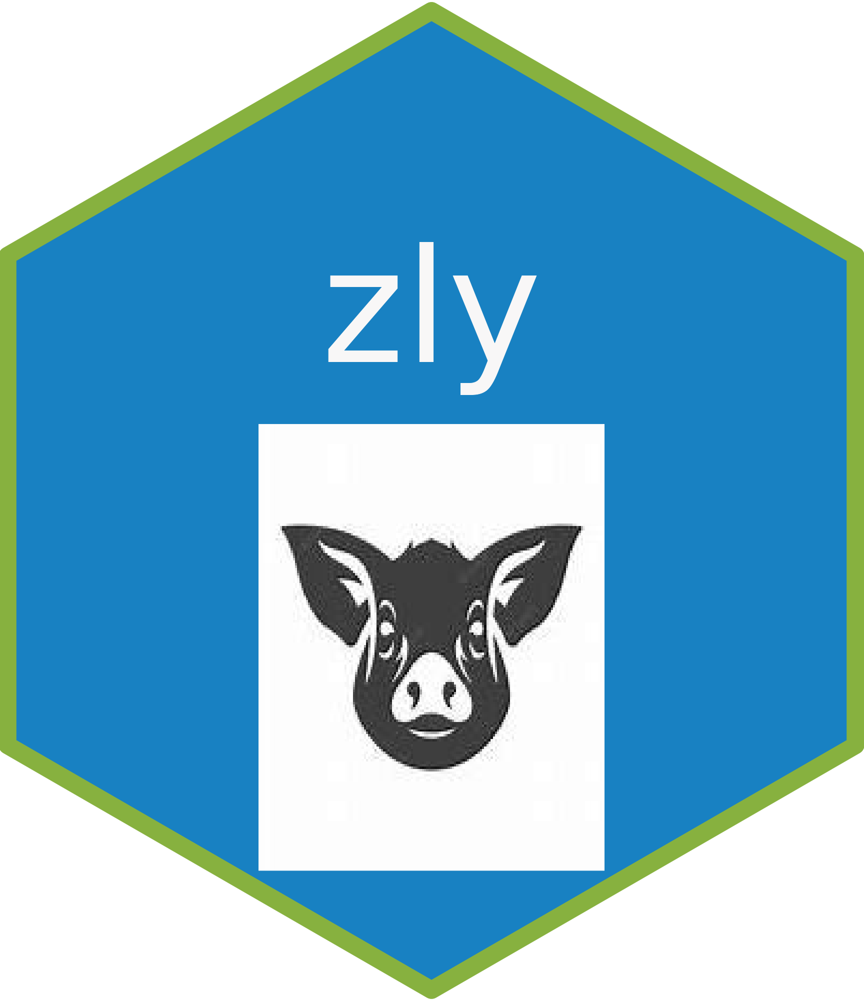

# zly 

<!-- badges: start -->

[](https://cran.r-project.org/package=pkgdown)

<!-- badges: end -->

The goal of zly is to help me.

[Manuals website](https://zly2024.netlify.app/)

## Installation

You can install the development version of zly like so:

``` r
remotes::install_github("zhly2024/zly")
```

## Example

This is a basic example which shows you how to solve a common problem:

``` r
library(zly)
library(tidyverse)

## basic example code

age = "0岁"

transform_age(age)
```
